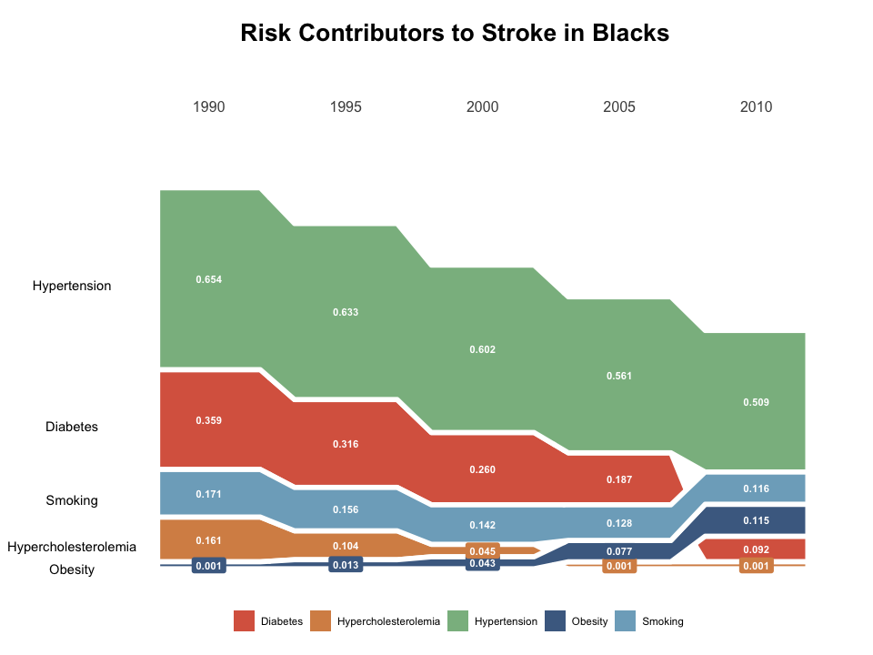
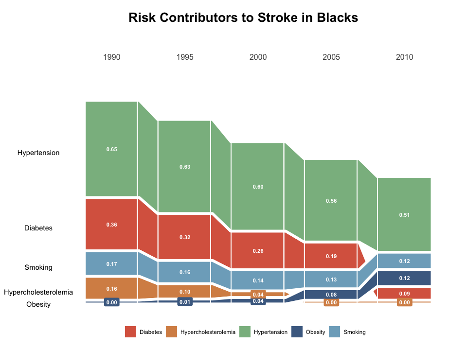
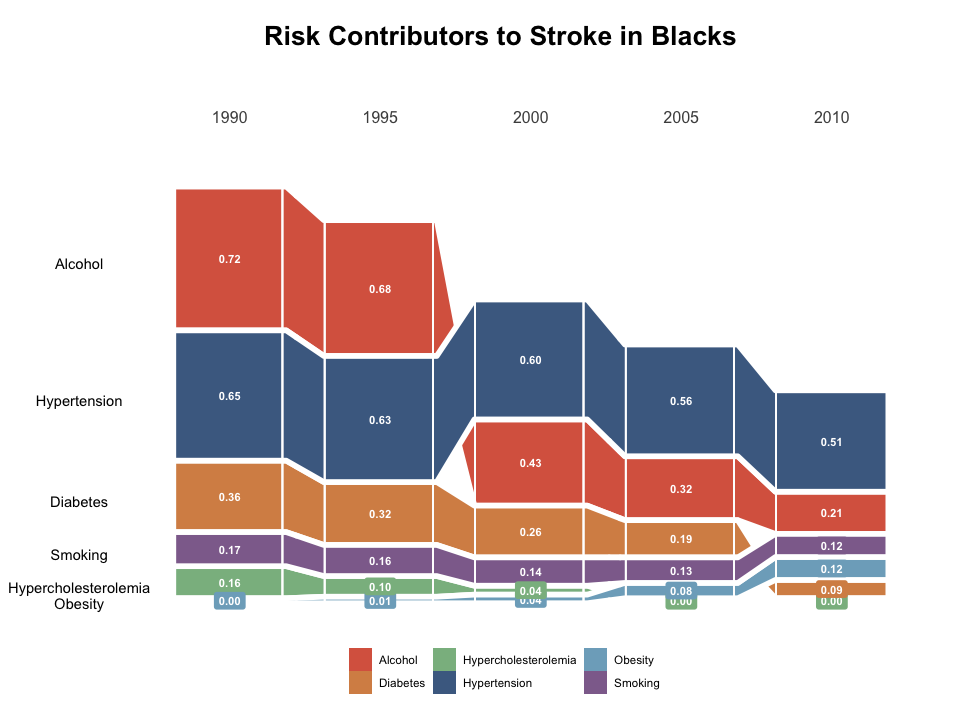

CedarSankey Vignette
================
Erica Ma
2024-07-18

# cedarsankey

This package transforms risk data into a sankey flow chart.

## Packages Needed

The cedarsankey pacakge is used along side several other frequently used
packages, such as tidyverse, dplyr, ggplot2, and ggalluvial. These
packages must be called prior to use of the cedarsankey package.

``` r
library(tidyverse)
library(dplyr)
library(ggplot2)
library(ggalluvial)
```

## Installation

The latest version of the cedarsankey package can be installed from
github:

``` r
devtools::install_github("https://github.com/ema888/cedarsankey")
```

## Example

There are 2 functions in the cedarsankey package. The first is
‘process_data’, which turns your dataframe into a long form table and
includes some transformations and calculated columns to use for the
sankey chart in the create_viz function. The create_viz function takes a
dataframe, calls the process_data function to transform the dataframe,
and outputs a sankey chart. You can choose to turn on vertical or
horizontal lines in the sankey chart to better visualize the data. There
is an argument to choose the number of decimals to round the labels to,
and an argument exists to choose the color for the different risk
factors.

The process_data function assumes that the first column of your
dataframe or tibble is the rownames/risk factors, and the column names
are the years. Here is what the ‘process_data’ function outputs:

``` r
data("risk")
data_risk <- process_data(risk)
head(data_risk, 10)
```

    ## # A tibble: 10 × 8
    ##    year  risk_factors         value  rank graph_value rank_year    x1    x2
    ##    <fct> <fct>                <dbl> <int>       <dbl>     <dbl> <dbl> <dbl>
    ##  1 1990  Obesity              0.001     5      0.025          1  1.35  1.63
    ##  2 1990  Diabetes             0.359     2      0.359          1  1.35  1.63
    ##  3 1990  Smoking              0.171     3      0.171          1  1.35  1.63
    ##  4 1990  Hypercholesterolemia 0.161     4      0.161          1  1.35  1.63
    ##  5 1990  Hypertension         0.654     1      0.654          1  1.35  1.63
    ##  6 1995  Obesity              0.013     5      0.0325         2  2.35  2.63
    ##  7 1995  Diabetes             0.316     2      0.316          2  2.35  2.63
    ##  8 1995  Smoking              0.156     3      0.156          2  2.35  2.63
    ##  9 1995  Hypercholesterolemia 0.104     4      0.104          2  2.35  2.63
    ## 10 1995  Hypertension         0.633     1      0.633          2  2.35  2.63

You probably won’t be using the process_data function directly, because
it is directly called in the ‘create_viz’ function. Note you can choose
which lines to show (horizontal or vertical) and how much to round the
labels to. Here is what the ‘create_viz’ outputs:

``` r
# note I put in the risk data before being processed
create_viz(risk, horizontal = FALSE, vertical = FALSE)
```

<!-- -->

``` r
create_viz(risk, horizontal = TRUE, vertical = FALSE, round = 3)
```

<!-- -->

``` r
create_viz(risk, horizontal = FALSE, vertical = TRUE, round = 3)
```

<!-- -->

``` r
create_viz(risk, horizontal = TRUE, vertical = TRUE)
```

<!-- -->

You can also change the colors or add additional colors in case you have
more or less risk factors in your data frame. The create_viz function
automatically takes up to 5 risk factors, and if you have extra risk
factors, you will need to give the lab_col (color of strata) argument a
new vector of the same length as the number of risk factors.

``` r
# create new dataframe with extra risk factor
risk_new <- rbind(risk, c("Alcohol", 0.722, 0.682, 0.433, 0.321, 0.212))
risk_new
```

    ## # A tibble: 6 × 6
    ##   ...1                 `1990` `1995` `2000` `2005` `2010`
    ##   <chr>                <chr>  <chr>  <chr>  <chr>  <chr> 
    ## 1 Obesity              0.001  0.013  0.043  0.077  0.115 
    ## 2 Diabetes             0.359  0.316  0.26   0.187  0.092 
    ## 3 Smoking              0.171  0.156  0.142  0.128  0.116 
    ## 4 Hypercholesterolemia 0.161  0.104  0.045  0.001  0.001 
    ## 5 Hypertension         0.654  0.633  0.602  0.561  0.509 
    ## 6 Alcohol              0.722  0.682  0.433  0.321  0.212

``` r
# graph risk_new 
create_viz(risk_new, horizontal = TRUE, vertical = TRUE, lab_col = c("#da654f", "#d78f54", "#8aba8f", "#4b6b91", "#7eacc5", "#8e6e9b"))
```

<!-- -->

## Citations

ggalluvial: Jason Cory Brunson and Quentin D. Read (2023). ggalluvial:
Alluvial Plots in ‘ggplot2’. R package version 0.12.5.
<http://corybrunson.github.io/ggalluvial/>

R-package: Chan, Fong Chun . “Making Your First R Package.”
Tinyheero.github.io, 26 July 2015,
tinyheero.github.io/jekyll/update/2015/07/26/making-your-first-R-package.html.
Accessed 17 July 2024.
